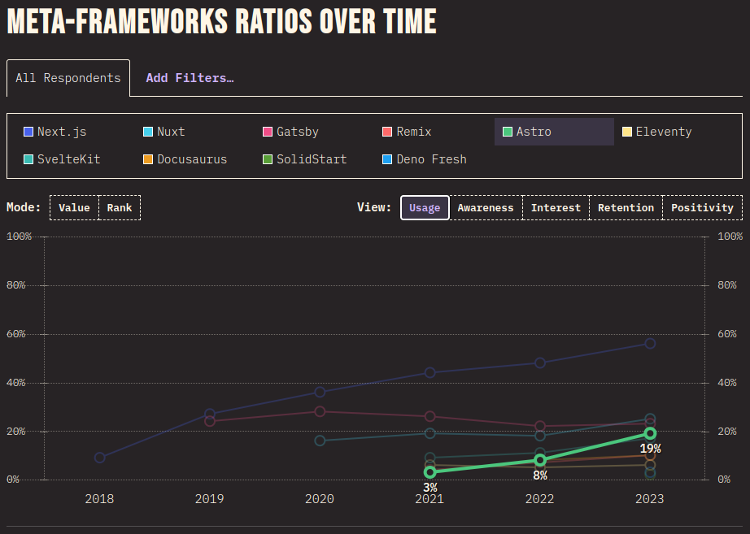

## Contents

## What is Astro

[Astro](https://astro.build) is another JavaScript (JS) web framework for creating incredibly fast, sites.
Astro is opinionated to optimise speed and improved SEO (Search Engine Optimisation) rating.
It does this by rendering components server side, minimising client side JS required for the site as possible and improving the SEO by sending HTML before sending required JavaScript, if any. I've talked about the performance gains from a hybrid of client side and server side rendering before in a previous blog post [The Fall & Resurgence of Server Side](20240202-the-fall-and-resurgence-of-server-side).

Astro allows you to plugin and use any major UI framework such as React, Vue, Preact, Svelte and SolidJs.
These frameworks are an opt-in integrations, which you install and add into Astro config, this integrations will use the specific framework's renderer to create elements. Then taking the HTML output and passing it to Astro to render, this allows any choice of frontend frameworks, which Astro has integrations built for. Lastly, any client side JS can be sent down to the client browser explicitly, this also follows an opt-in approach to prevent excessive JS being sent to the browser taking longer for the site to load, but all the JS will be deferred from being sent until the static content (HTML and CSS) has been sent and painted.

Astro has grown in popularity largely for it's static site generation capabilities, using the latest tech with built-in batteries included from [vite](https://vitejs.dev/), markdown to HTML generation (Frontmatter support, [remark](https://github.com/remarkjs/remark) & [rehype](https://github.com/rehypejs/rehype)), type generations using [Zod](https://zod.dev/), server-side support and great development experience, with the as mentioned focus on performance and isolating deferred client JavaScript in hydrated "Islands", allowing support of having a mix of multiple UI frameworks:


(Source: [Astro Islands](https://docs.astro.build/en/concepts/islands/))

These Islands can be built with any framework with the JS, including relevant framework, bundled in, if you think about that, you can inject other components even remotely, making it incredibly easy to implement Microfrontends. Here's an example, but you can [read more in this article](https://medium.com/@sergio.a.soria/setting-up-micro-frontends-with-astro-and-ecma-script-modules-137340d2c520):

```jsx showLineNumbers
import MicroFrontendA from 'http://localhost:7100/bundle.js';  
import MicroFrontendB from 'http://localhost:7200/bundle.js';  
  
const ReactComponent = () => (  
	<>
		<React.Suspense fallback="Loading…">
			<MicroFrontendA />
		</React.Suspense>

		<React.Suspense fallback="Loading…">
			<MicroFrontendB />
		</React.Suspense>
	</>
);  
  
export default ReactComponent;
```

These islands are isolated from eachother in the DOM through [HTML Web Components](https://developer.mozilla.org/en-US/docs/Web/API/Web_components), which uses shadow DOM to encapsulate the code and make it private, ensuring no code outside of the web component can modify it and prevent collisions. Checkout the 'astro-island' HTML web component output of one of these islands:


Note the data attributes is how you can pass data into the web component, through to the shadow DOM and the web component's JavaScript. But you can also see how the language specific renderer is being passed in to be used.

Another notable thing about Astro is that you can also take quick advantage of what functionality you're after with Astro pre-built themes (free or paid) and [templates](https://github.com/withastro/astro/tree/main/examples) with either official examples:

```sh showLineNumbers=false frame="none"
npm create astro@latest -- --template <example-name>
```

Astro v1 framework was GA released June 2022 and has since made its way to v4. According to [State Of JS 2023 Meta Frameworks](https://2023.stateofjs.com/en-US/libraries/meta-frameworks/), Astro has grown in usage (19%) to rival Gatsby (23%) and Nuxt (25%), which is is not as high as Next.js (56%) but a positive growth:


(Source:  [State Of JS 2023 Meta Frameworks](https://2023.stateofjs.com/en-US/libraries/meta-frameworks/))

Additionally, the overall positive rating of Astro (54%) has made it 2nd to Next.js (64%), and the focus on development experience with performance defaulted, has left it feeling flexible and easy to use:


(Source:  [State Of JS 2023 Meta Frameworks](https://2023.stateofjs.com/en-US/libraries/meta-frameworks/))

## Components & Syntax

Astro components are written using [Markdown frontmatter](https://frontmatter.codes/docs/markdown) to fence (`---`) off server side javascript, Component Script, and the HTML + JS Expressions component, Component Template:

```astro showLineNumbers=false
---
// Component Script (JS)
---
<!-- Component Template (HTML + JS Expressions) -->
```

If you have server side rendering or hybrid output set, means you can use server side JavaScript to call external resources with secrets, then send down the rendered HTML to the client, like so: 

```js title="astro.config.mjs" showLineNumbers ins={4}
import { defineConfig } from 'astro/config';

export default defineConfig({
  output: 'hybrid'
})
```

Note the outputs are:

> `static` - Default: Building a static site to be deployed to any static host.
> 
> `server` - Building an app to be deployed to a host supporting SSR (server-side rendering).
>
> `hybrid` - Building a static site with a few server-side rendered pages.

```astro title="src/pages/index.asto" showLineNumbers
---
import { connectDb } from "...";

interface Props {
  title: string;
}

const { title } = Astro.props;

export const database = connectDb(
  import.meta.env.DATABASE_URL,
  import.meta.env.DATABASE_KEY,
);

const data = await database.get();
const TitleElementTag = 'h1'
---

<div>
	<TitleElementTag class="font-bold" data-test-id="items-header">
		{title}
	</TitleElementTag>
	<ul>
		{data.map(item => (<li>{item}</li>))}
	</ul>
</div>
```

There's also a bit to unpack in the above:

- Top level await
- Typescript support
- Dynamic HTML element tags
- Props passed to child component
- JSX-like support, note `class` instead of `className` and kebab-case instead of camel-case

## Client-Side JavaScript

Out of the box, Astro focuses on static or server side rendering rather than client side, in turn this reduces the amount of JavaScript sent to the client whilst reducing browser paint times, you may even notice that all content is transformed into HTML on build, event markdown and MDX files. However, you'll of course need client side JavaScript for interactive of buttons, search bars, drop downs and more, but this needs to be explicitly set or Astro will not send the required JavaScript.

There are a few options to optimise it as well, let's see what this looks like if had a banner message which we want to have a close button:

```astro title="src/pages/index.astro" showLineNumbers
---
// This is staticly built into the HTML output or server side rendered
// this uses a argument passed in or uses the default, e.g.
// `<Index bannerMessage={Override the banner message} />` 
const {
	bannerMessage = 'This message is brought to you by jbrlloyd.dev'
} = Astro.props;
---

<!doctype html>
<html lang="en">
	<head>...</head>
	<header>...</header>
	<body>

		{bannerMessage && (
			<div id="content-banner">
			  <p>{bannerMessage}</p>
			  <button id="close-content-banner-btn">
				<b>X</b>
			  </button>
			</div>
		)}

	</body>
	<footer>...</footer>
</html>

<!--
	Astro will compile this into your `<head>` with type="module", preventing 
	rendering blocking of HTML and will be deferred + lazy loaded with async.
	We can use `is:inline `directives to opt-out of this optimizations and
	render it in the HTML: `<script is:inline>` or `<script is:global>` to
	not just scope it to this component
-->
<script>
	const closeBtn = document.getElementById('close-content-banner-btn');
	
	if (closeBtn) {
		closeBtn.addEventListener('click', onClick)
	}
	
	function onClick() {
		closeContentBanner()
		closeBtn?.removeEventListener('click', onClick)
	}
	
	function closeContentBanner() {
		const contentBanner = document.getElementById('content-banner');
		
		if (contentBanner)
			contentBanner.style.display = 'none'
	}
</script>
```

## Integrating Other UI Frameworks

Astro offers the ability to plugin integrations to add functionality such as mdx, sitemaps, tailwind and other UI frameworks such as React, Vue, Svelte, Preact, SolidJS, lit and others.
An example of how we'd setup SolidJs with client side JavaScript is as such:

```js title="astro.config.mjs" showLineNumbers {8}
import { defineConfig } from 'astro/config';
import solidJs from '@astrojs/solid-js';
import react from '@astrojs/react';
import mdx from '@astrojs/mdx';

export default defineConfig({
  site: 'https://example.com',
  integrations: [ solidJs(), react(), mdx() ] // <-- Note you can have multiple UI frameworks
});
```

```tsx title="src/components/solid/SolidJsCounter.tsx" showLineNumbers
import { type Component, createSignal } from 'solid-js';

export default const SolidJsCounter : Component = () => {
  const [count, setCount] = createSignal(0);

  return (
    <>
      <p>Count: {count}</p>
      <button onClick={() => setCount(count => count - 1)}>Decrement</button>
      &nbsp;
      <button onClick={() => setCount(count => count + 1)}>Increment</button>
    </>
  )
}
```

We can now import the SolidJS component, however, because we're making use of client side JavaScript, we need to explicitly provide a client directive, or else the client side JS will not be sent by Astro framework:

```astro title="src/pages/index.astro" showLineNumbers=false
---
// Server side JavaScript
import SolidJsCounter from '../components/solid/SolidJsCounter.tsx';
---
// Without client directive `client:load` no javascript will be sent to the browser
// and therefore the on click will not do anything.
<SolidJsCounter client:load />
```

### Sharing state between UI frameworks

One problem with having the ability of multiple UI frameworks, is sharing state across them, as usually the state managers are language specific. Hence, the Astro recommendation is using [Nano Stores](https://github.com/nanostores/nanostores), which is lightweight (> 1 KB) and framework agnostic.
Let's see how we can create 2 counters in different frameworks which increment and decrement the same state:

```ts title="src/stores/countStore.ts" showLineNumbers
import { atom, map } from 'nanostores';

export const count = atom(0);

export const incrementCount = () => count = count.get() + 1;
export const decrementCount = () => count = count.get() - 1;
```

```tsx title="src/components/solid/SolidJsCounter.tsx" showLineNumbers
import { type Component } from 'solid-js';
import { useStore } from '@nanostores/solid';

import { count, incrementCount, decrementCount } from '../../sores/countStore';

export default const SolidJsCounter : Component = () => {
  const $count = useStore(count);

  return (
    <>
      <p>Count: {$count}</p>
      <button onClick={() => decrementCount()}>Decrement</button>
      &nbsp;
      <button onClick={() => incrementCount()}>Increment</button>
    </>
  )
}
```

```tsx title="src/components/react/ReactCounter.tsx" showLineNumbers
import { type FunctionComponent } from 'react';
import { useStore } from '@nanostores/react';

import { count, incrementCount, decrementCount } from '../../sores/countStore';

export default const ReactCounter : FunctionComponent = () => {
  const $count = useStore(count);

  return (
    <>
      <p>Count: {$count}</p>
      <button onClick={() => decrementCount()}>Decrement</button>
      &nbsp;
      <button onClick={() => incrementCount()}>Increment</button>
    </>
  )
}
```

```astro title="src/pages/index.astro" showLineNumbers
---
import SolidJsCounter from '../components/solid/SolidJsCounter.tsx';
import ReactCounter from '../components/react/ReactCounter.tsx';
---
<div id="wrapper">
	<SolidJsCounter client:only="solid-js" />
	<ReactCounter client:only="react" />
</div>

<script>
	import { count } from '../stores/countStore';

	const wrapper = document.getElementById('wrapper');

	count.subscribe((countVal: number) => {
		if (!wrapper)
			return;

		if (countVal % 2 === 0) {
			wrapper.style.backgroundColor = 'blue';
		} else {
			wrapper.style.backgroundColor = 'green';
		}
	})
</script>
```

## SSR Adaptors

Astro is largely designed for static sites, where it the entire site gets compiled to HTML and CSS, served from a file storage with a web server like nginx or apache serving the files.
However, we make use of server-side rendering (SSR) through one of the following official adaptors:

- CloudFlare
- Netlify
- Vercel
- Node
- And others such as: Deno Deploy, GitHub Pages, AWS, Firebase, Azure, Google Cloud, Heroku + more

Note that node will allow us to host our site with SSR ourselves through most self-hosting mechanisms such as using containers. Each adaptor has different configuration and setup, but all require setting the Astro configuration to `output` a server side capability.
Let's hone in on CloudFlare adapter, first we have to install the adapter into our Astro project:

```sh showLineNumbers=false
pnpm astro add cloudflare
pnpm add @astrojs/cloudflare
```

```js title="astro.config.mjs" showLineNumbers ins={2, 5-6}
import { defineConfig } from 'astro/config';
import cloudflare from '@astrojs/cloudflare';

export default defineConfig({
  output: 'hybrid', // or full server side with 'server'
  adapter: cloudflare(),
});
```

After enabling CloudFlare (CF) adaptor functionality, we can create a CF pages site and connect it to our repository for automatic deployment. Some functionality between CloudFlare and Astro may not be compatible, allowing the site to work locally when using:
`astro check && astro build && astro build`
but not working when deploying to CF Pages. So the best way to ensure your site will work in CF locally is to use CF Pages emulator via the CF CLI `wrangler`.
Install this and preview:

```sh showLineNumbers=false
npm install -g wrangler
wrangler login
pnpm add wrangler --save-dev
```

We can also wire this up in our project's CLI, note that Astro will compile files into `dist/` directory as it's build output:

```json title="package.json" showLineNumbers
{
	// ...,
	"scripts": {
		"build": "wrangler types && astro check && astro build",
		"preview:cf": "pnpm run build && wrangler pages dev ./dist",
		//...
	},
	//...
}
```

`wrangler pages dev ./dist` will emulate a CF page worker using the Astro build output as the root.

If you do want to setup using CloudFlare pages, you can simply create a page, connect it to a git repository and then select `Astro` Framework preset, this'll take the main branch and deploy it as well as hook into any new commits on the branch and rebuild & deploy (`pnpm`, `yarn` + [others](https://blog.cloudflare.com/moderizing-cloudflare-pages-builds-toolbox/) package managers are support if you wish to change the build command to the corresponding manager):


If you do go down this route, out of the box you'll get preview builds and hosting on non-main branches and I also recommend you turn on build caching to take your build time down from 2-3 mins to >1 min! 🚀


## Recommended Plugins

Out of the box markdown (and MDX integration is added) files are processed by [remark](https://github.com/remarkjs/remark), which processes markdown into an AST and allows plugins to modify outputs, then outputs it through [rehype](https://github.com/rehypejs/rehype). Find more in the list of [remark plugins](https://github.com/remarkjs/remark/blob/main/doc/plugins.md#list-of-plugins) or [rehype plugins](https://github.com/rehypejs/rehype/blob/main/doc/plugins.md).

Here are some of my recommendations:

- `@astrojs/mdx` - adds MDX support for content.
- `@playform/compress` - compress css, images, html, js and images (through minification and other mechanisms).
- `remark-toc` - Automatically generates a Table of Content based on headers.
- `astro-expressive-code` - Adds great looking styles around code blocks, including file names, line numbers, diff highlighting and more.
- `rehypeAccessibleEmojis` - Add accessibility to emojis without needing to do anything more.
- `rehype-slug` + `rehype-autolink-headings` - Adds ID attributes to headers and links to attach to them.
- If you have the desire to tailwindcss, you should use [tailwindcss typography](https://github.com/tailwindlabs/tailwindcss-typography) to break out of the cascading styles and add specific styling around the areas requiring styling.

## Final Thoughts

I had initially built a Wordpress blog to get more into Wordpress development, but then realised that most of the things I wanted to do was incredibly difficult to implement due to how the framework restricts you. So I tried converting it to React Gatsby.js, this led to a different level of frustrations in dealing with plugins and more often then not, breaking things and other plugins which, overall it felt like a very complicated trying to make minor changes.

Astro has been a very pleasant experience with a well architected solution which is highly flexible and developer first experience, adding Obsidian note taking for writing MD or MDX makes for an additional pleasantry. I won't say it's perfect because it does have downfalls, here's some of them from my experience:

| Pros                                                                                                                                                                                                                                  | Cons                                                                                                                                                                                                                                                                                                                                                              |
| ------------------------------------------------------------------------------------------------------------------------------------------------------------------------------------------------------------------------------------- | ----------------------------------------------------------------------------------------------------------------------------------------------------------------------------------------------------------------------------------------------------------------------------------------------------------------------------------------------------------------- |
| Compiles chunks into component level with optional output of static, server side or hybrid components.                                                                                                                                | Added complexity in how to manage and optimise images when using hybrid or complete server side.<br>Additionally, SSR adaptors may have compatibility issues compared to running Astro build locally.                                                                                                                                                             |
| Focused on performance, including async deferred JavaScript and sending HTML first.                                                                                                                                                   | If using other UI frameworks, you cannot separate the HTML and JavaScript, meaning the whole component load is deferred and asynchronously loaded. This forces your to write static DOM elements you want to have on the UI separately in Astro, as there's no way to separate this out otherwise.                                                                |
| Isolated web component islands which encapsulate components logic and prevent collisions, whilst also allowing have many different UI framework components. This also makes migration or reusing other components very easy and safe. | Astro components use vanilla javascript, losing the structure, automatic event listener bindings, forced to move relevant JS away from the DOM Elements and not in-built state management and state reactive DOM manipulations. But you don't need to worry about browser compatibility since the script tags and files will be processed by Typescript compiler. |
| Built on latest technologies & exhaustive official plugins with sensible defaults which can be overridden.                                                                                                                            | State/Store technology has to be compatible with vanilla JS + any UI framework you wish to use, which is limiting in terms of features and libraries. Nanostores for example isn't in major V1 yet.                                                                                                                                                               |
| Support for SSR with adapters which can hook-in to run the app + many hosting services supporting SSR, not just static, [check them out](https://docs.astro.build/en/guides/deploy/).                                                 |                                                                                                                                                                                                                                                                                                                                                                   |
| Exhaustive collection of plugins (official and unofficial) with a great plugin system that doesn't collide. With an impressive handling of mdx and markdown support without issues affect one or the other.                           |                                                                                                                                                                                                                                                                                                                                                                   |
| Astro devtools is incredibly great at highlighting performance or accessibility issues.                                                                                                                                               |                                                                                                                                                                                                                                                                                                                                                                   |
